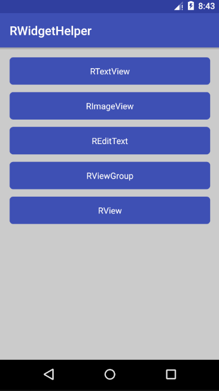
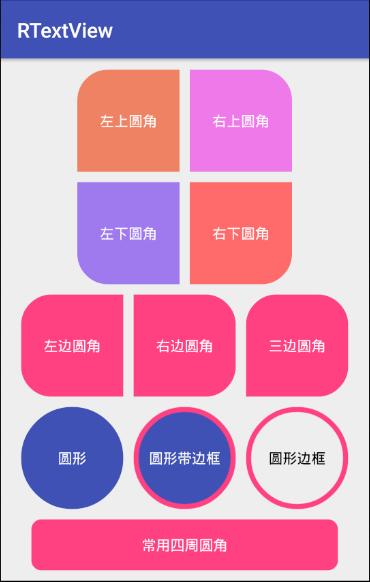
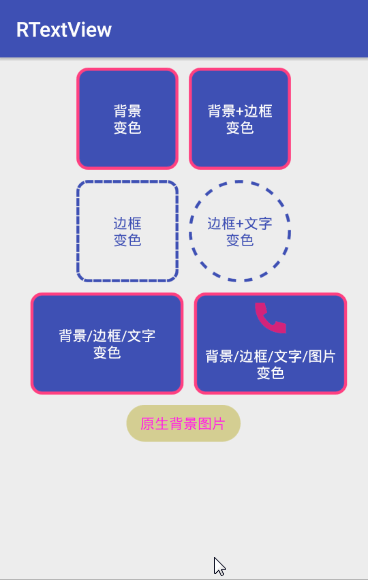
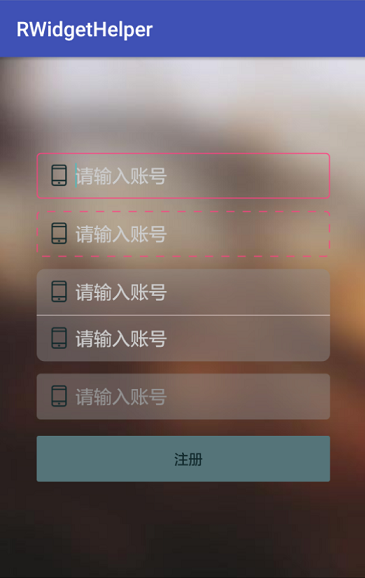

# RWidgetHelper


## 欢迎使用 RWidgetHelper 

### 说明

> 在Android开发中经常需要实现，基础控件的：圆角，边框，State各个状态的UI样式
> 
> 基于快速开发，优化代码，简化使用的目的推出一套基于基础控件的封装

### 优点

> 1.不再编写大量的 selector 实现圆角效果，不再低声下气恳求美术切图
>     
> 2.不在代码中各种 if else 判断 State 状态，改变UI样式
>    
> 3.所有控件继承原生控件，添加 Helper 实现，基础API通用，代码包大小几乎忽略不计
>    
> 4.一套 RWidgetHelper 控件几乎可以实现基础开发所有需求，不再到处找控件
>   
> 5....太多了自己发掘吧~~

### 缺点

> 我写的东西怎么可能优缺点？？？  非要说一个，只能是现在的版本功能相对简单，后续版本迭代中不断添加常用功能


### 效果图一览

> 示例效果图，不限于如此，更多使用详细参考相关属性

 

### 通用属性

> 1. corner_radius       指定四周圆角 
>    
> 2. corner_radius_xx    指定某一方向圆角
>    
> 3. border_color_xx     各个state状态边框颜色 
>    
> 4. border_width_xx     各个state状态边框宽度
>    
> 5. border_dash_width   虚线边框 宽度
>   
> 6. border_dash_gap     虚线边框 间隔
>   
> 7. background_xx       各个state状态背景颜色
> 

### 使用
> ###  Gradle （版本号根据更新历史使用最新版）

    compile 'com.ruffian.library:RWidgetHelper:1.0.1'

### 1.RTextView

### 1.特点

> 1. RTextView 让你从此不再编写和管理大量 selector 文件（这个太可恨了）
>    
> 2. RTextView 改造了 drawableLeft/drawableXXX 图片的大小，从此你不在需要使用 LinearLayout + ImageView + TextView 就能够直接实现文字带图片的功能，关键还能设置icon大小
>   
> 3. RTextView 能够直接设置各种圆角效果： 四周圆角，某一方向圆角，甚至椭圆，圆形都简单实现。 边框效果，虚线边框都是一个属性搞定
>   
> 4. RTextView 不仅能够定义默认状态的背景，边框，连按下/点击状态通通一起搞定
>   
> 5. RTextView 按下变色支持：背景色，边框，文字，drawableLeft/xxx （这个赞啊）
>   
> 6. RTextView 支持指定字体样式


### 2.效果图

> 示例效果图，不限于如此，更多使用详细参考相关属性

   


### 3.属性说明

> 开发者根据实际需要选择使用对应的功能属性


| 属性			|说明			 |
| ------------- |  :-------------|
| corner_radius      			|	圆角		四周		|
| corner_radius_top_left        |   圆角		左上		|
| corner_radius_top_right 		|	圆角		右上		|
| corner_radius_bottom_left 	|   圆角		左下		|
| corner_radius_bottom_right 	|   圆角		右下 	|
| border_dash_width 			|   虚线边框 	宽度 	|
| border_dash_gap 				|   虚线边框 	间隔 	|
| border_width_normal 			|   边框宽度 	默认 	|
| border_width_pressed 			|   边框宽度 	按下 	|
| border_width_unable 			|   边框宽度 	不可点击 |
| border_color_normal 			|   边框颜色 	默认		|
| border_color_pressed 			|   边框颜色 	按下 	|
| border_color_unable 			|   边框颜色 	不可点击 |
| background_normal 			|   背景颜色 	默认 	|
| background_pressed 			|   背景颜色 	按下 	|
| background_unable 			|   背景颜色  	不可点击 |
| text_color_normal 			|   文字颜色 	默认 	|
| text_color_pressed      		|   文字颜色 	按下 	|
| text_color_unable      		| 	文字颜色 	不可点击 |
| icon_src_normal      			|   drawable icon 	默认 		|
| icon_src_pressed      		|   drawable icon 	按下 		|
| icon_src_unable      			| 	drawable icon 	不可点击 	|
| icon_height      				| 	drawable icon 	高 			|
| icon_width      				|   drawable icon 	宽 			|
| icon_direction      			|   drawable icon 	位置{left,top,right,bottom} |
| text_typeface      			|   字体样式 |

### 4.使用

> ### 4.1 XML使用

    <com.ruffian.library.widget.RTextView
        android:layout_width="100dp"
        android:layout_height="100dp"
        android:gravity="center"
        android:text="文本控件"

        //背景颜色 对应三个状态
        rtv:background_normal="#3F51B5"
        rtv:background_pressed="#FF450F21"
        rtv:background_unable="#c3c3c3"

        //边框颜色 对应三个状态
        rtv:border_color_normal="#FF4081"
        rtv:border_color_pressed="#3F51B5"
        rtv:border_color_unable="#c3c3c3"

        //边框宽度 对应三个状态 一般设置相同值
        rtv:border_width_normal="3dp"
        rtv:border_width_pressed="4dp"
        rtv:border_width_unable="5dp"

        //虚线边框 1.虚线边框宽度 2.虚线间隔
        rtv:border_dash_width="10dp"
        rtv:border_dash_gap="4dp"

        //圆角度数 1.四周统一值 2.四个方向各个值
        //xml:  通过xml 设置了 corner_radius ，则 corner_radius_xxx 不起作用
        //java: 通过java代码设置 corner_radius_xxx ，则 corner_radius 不起作用
        rtv:corner_radius="10dp"
        rtv:corner_radius_top_left="10dp"
        rtv:corner_radius_bottom_left="15dp"
        rtv:corner_radius_bottom_right="20dp"
        rtv:corner_radius_top_right="25dp"

        //drawableXXX icon 对应三个状态
        rtv:icon_src_normal="@mipmap/icon_phone_normal"
        rtv:icon_src_pressed="@mipmap/icon_phone_pressed"
        rtv:icon_src_unable="@mipmap/icon_phone_unable"

        //drawableXXX icon 方向 {上,下,左,右}
        rtv:icon_direction="top"

        //drawableXXX icon 宽/高
        rtv:icon_height="30dp"
        rtv:icon_width="30dp"

        //文字颜色 对应三个状态
        rtv:text_color_normal="#c3c3c3"
        rtv:text_color_pressed="#3F51B5"
        rtv:text_color_unable="#FF4081"

        //字体样式
        rtv:text_typeface="fonts/RobotoMono-Thin.ttf"
        />


> ### 4.2 以上属性均提供Java代码 get/set 方法

        RTextView textView = (RTextView) findViewById(R.id.text1);
        //获取Helper
        RTextViewHelper tvHelper = textView.getHelper();
        tvHelper.setIconNormal(getDrawable(R.mipmap.ic_launcher))
                 .setIconHeight(10)
                 .setIconWidth(20)
                 .setIconDirection(RTextViewHelper.ICON_DIR_TOP);


> ### 4.3 备注

	1. 圆角边框，圆角背景等属性需要配合 `background_xxx` 自定义背景属性使用，原生 `background` 没有效果

### 2.REditText

> REditText 使用方法跟 RTextView 完全一致




### 3. RLinearLayout  / RRelativeLayout  /  RView

> RLinearLayout
> 
> RRelativeLayout 
> 
> RView 
> 
> 这三个控件只支持基本属性

| 属性			|说明			 |
| ------------- |  :-------------|
| corner_radius      			|	圆角		四周		|
| corner_radius_top_left        |   圆角		左上		|
| corner_radius_top_right 		|	圆角		右上		|
| corner_radius_bottom_left 	|   圆角		左下		|
| corner_radius_bottom_right 	|   圆角		右下 	|
| border_dash_width 			|   虚线边框 	宽度 	|
| border_dash_gap 				|   虚线边框 	间隔 	|
| border_width_normal 			|   边框宽度 	默认 	|
| border_width_pressed 			|   边框宽度 	按下 	|
| border_width_unable 			|   边框宽度 	不可点击 |
| border_color_normal 			|   边框颜色 	默认		|
| border_color_pressed 			|   边框颜色 	按下 	|
| border_color_unable 			|   边框颜色 	不可点击 |
| background_normal 			|   背景颜色 	默认 	|
| background_pressed 			|   背景颜色 	按下 	|
| background_unable 			|   背景颜色  	不可点击 |


  


### 4. RImageView

> RImageView 不再提供背景各个state背景颜色,提供了各个state的icon
>   
> 1.圆形图片
>   
> 2.圆角图片
>   
> 3.指定某一方向圆角图片
>   
> 4.边框
>    
> 5.各个state状态的图片 默认/按下/不可点击
>   


> ### 属性说明

| 属性			|说明			 |
| ------------- |  :-------------|
| corner_radius      			|	圆角		四周		|
| corner_radius_top_left        |   圆角		左上		|
| corner_radius_top_right 		|	圆角		右上		|
| corner_radius_bottom_left 	|   圆角		左下		|
| corner_radius_bottom_right 	|   圆角		右下 	|
| border_width		 			|   边框宽度		 	|
| border_color					|   边框颜色 		|
| icon_src_normal      			|   icon 	默认 		|
| icon_src_pressed      		|   icon 	按下 		|
| icon_src_unable      			| 	icon 	不可点击 	|
| is_circle	      				| 	是否圆形图片 			|

> ### xml使用

    <com.ruffian.library.widget.RImageView
                android:layout_width="100dp"
                android:layout_height="100dp"
                android:layout_marginLeft="10dp"
				//边框	
                app:border_color="@color/colorAccent"
                app:border_width="2dp"
				//圆角相关
                app:corner_radius="10dp"
                app:corner_radius_bottom_left="10dp"
                app:corner_radius_bottom_right="10dp"
                app:corner_radius_top_left="10dp"
                app:corner_radius_top_right="10dp"
				//state状态资源
                app:icon_src_normal="@mipmap/icon_man"
                app:icon_src_pressed="@mipmap/icon_man_pressed"
				app:icon_src_unable="@mipmap/icon_man_pressed"
				//是否圆形
                app:is_circle="true" />

> ### Java代码使用
    
        RImageView imageView = (RImageView) findViewById(R.id.iv);
        //获取Helper
        RImageViewHelper ivHelper=imageView.getHelper();
        ivHelper.setIconNormal(getDrawable(R.mipmap.icon_man))
                .setIconPressed(getDrawable(R.mipmap.icon_man_pressed));


 ### 项目前身 [RTextView](https://github.com/RuffianZhong/RTextView)

### 版本历史

**v1.0.1**　`2018.08.20`　Fix bug setEnabled [issues #7](https://github.com/RuffianZhong/RWidgetHelper/issues/7)

**v1.0.0**　`2018.04.26`　发布第一版本

## License

```
MIT License

Copyright (c) 2018 Ruffian-痞子

Permission is hereby granted, free of charge, to any person obtaining a copy
of this software and associated documentation files (the "Software"), to deal
in the Software without restriction, including without limitation the rights
to use, copy, modify, merge, publish, distribute, sublicense, and/or sell
copies of the Software, and to permit persons to whom the Software is
furnished to do so, subject to the following conditions:

The above copyright notice and this permission notice shall be included in all
copies or substantial portions of the Software.

THE SOFTWARE IS PROVIDED "AS IS", WITHOUT WARRANTY OF ANY KIND, EXPRESS OR
IMPLIED, INCLUDING BUT NOT LIMITED TO THE WARRANTIES OF MERCHANTABILITY,
FITNESS FOR A PARTICULAR PURPOSE AND NONINFRINGEMENT. IN NO EVENT SHALL THE
AUTHORS OR COPYRIGHT HOLDERS BE LIABLE FOR ANY CLAIM, DAMAGES OR OTHER
LIABILITY, WHETHER IN AN ACTION OF CONTRACT, TORT OR OTHERWISE, ARISING FROM,
OUT OF OR IN CONNECTION WITH THE SOFTWARE OR THE USE OR OTHER DEALINGS IN THE
SOFTWARE.
```

