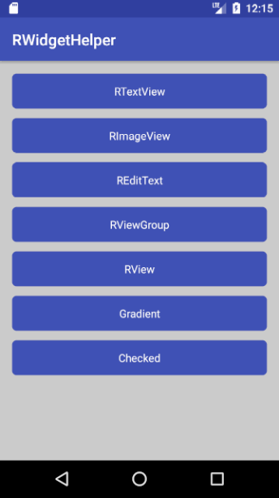
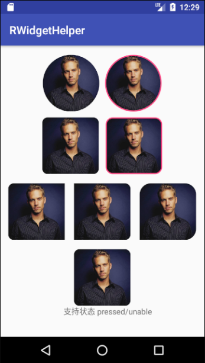
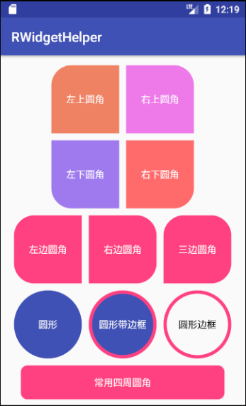
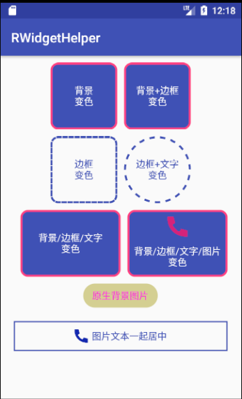
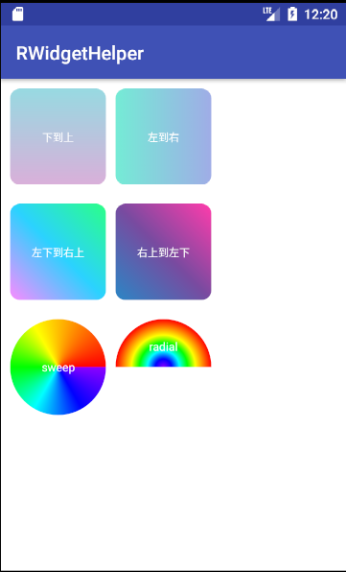
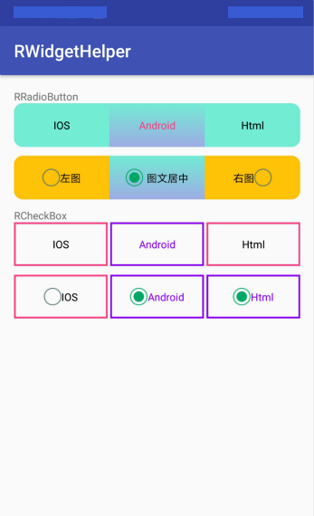
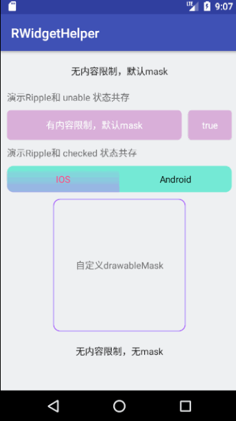
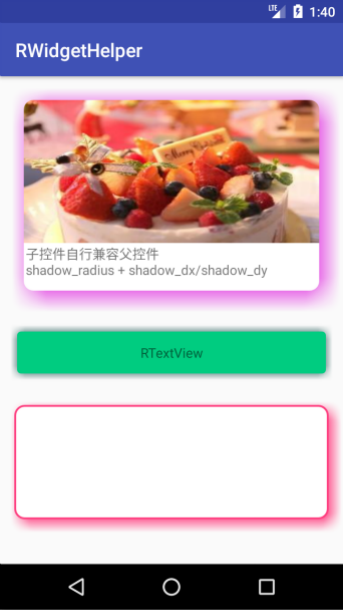

# RWidgetHelper

## 欢迎使用 RWidgetHelper

### 宗旨：专治原生控件各种不服

### 目标：Android UI 快速开发

### 说明

> Android UI 开发常用：圆角，边框，Gradient背景渐变，控件State各个状态UI样式，阴影，水波纹
>
> 普通解决方案缺点：代码冗余，复用性差，自由度低
>
> RWidgetHelper优点：优化代码，简化使用，快速开发
>

### 简介

    通过继承原生控件，设置自定义属性，解决常用 Selector，Gradient，Shape， 阴影，水波纹等功能
	
	原生控件都可实现 **基础功能** ，针对具体控件还有 **个性功能**


## 基础功能

| 功能			| 属性值			 				| 可用State状态				| 特性				 |
| ------------- | -------------  				| ------------- 			| -------------		 |
| 圆角 			| 颜色  			 				| 默认/按下/不可用/选中 		| 四周圆角/单个方向圆角 |
| 边框宽度 		| 数值  			 				| 默认/按下/不可用/选中 		| 实线/虚线边框		 |
| 边框颜色 		| 颜色  			 				| 默认/按下/不可用/选中		| 实线/虚线边框		 |
| 背景			| 颜色/颜色数组/drawable  		| 默认/按下/不可用/选中 		| 纯色/渐变/Drawable	 |
| 水波纹			| --  							| -- 						| 点击效果水波纹	 	 |
| 阴影			| --  							| -- 						| 控件四周阴影	 	 |
| 裁剪布局		| --  							| -- 						| 裁剪子控件内容	 	 |
#### 属性介绍

| 属性			|说明			 |
| ------------- |  :-------------|
| corner_radius      			|	圆角		四周		>=正方形宽度/2实现圆形|
| corner_radius_top_left        |   圆角		左上		|
| corner_radius_top_right 		|	圆角		右上		|
| corner_radius_bottom_left 	|   圆角		左下		|
| corner_radius_bottom_right 	|   圆角		右下 	|
| border_dash_width 			|   虚线边框 	宽度 	|
| border_dash_gap 				|   虚线边框 	间隔 	|
| border_width_normal 			|   边框宽度 	默认 	|
| border_width_pressed 			|   边框宽度 	按下 	|
| border_width_unable 			|   边框宽度 	不可点击 |
| border_width_checked 			|   边框宽度 	选中		|
| border_width_selected 		|   边框宽度 	选择		|
| border_color_normal 			|   边框颜色 	默认		|
| border_color_pressed 			|   边框颜色 	按下 	|
| border_color_unable 			|   边框颜色 	不可点击 |
| border_color_checked 			|   边框颜色 	选中		|
| border_color_selected 		|   边框颜色 	选择		|
| background_normal 			|   背景   	 	默认 	|
| background_pressed 			|   背景		 	按下 	|
| background_unable 			|   背景		  	不可点击 |
| background_checked 			|   背景		  	选中		|
| background_selected 			|   背景		  	选择		|
| gradient_orientation 			|	渐变的方向	参考 GradientDrawable.Orientation:TOP_BOTTOM，TR_BL...	|
| gradient_type     			|   渐变的样式	linear线性，radial径向，sweep扫描式	默认：linear|
| gradient_radius 				|	渐变半径	 默认:（宽或高最小值）/ 2 |
| gradient_centerX 				|   渐变中心点X坐标（0.0-1.0）	0.5表示中间	默认:0.5 |
| gradient_centerY 				|   渐变中心点Y坐标（0.0-1.0）	0.5表示中间	默认:0.5 |
| ripple 						|   是否开启水波纹效果，true/false |
| ripple_color	 				|   水波纹效果颜色 |
| ripple_mask_style	 			|   水波纹效果限制样式，none:无限制 normal:默认跟随控件背景形状 drawable:自定义形状 |
| ripple_mask 					|   水波纹效果限制自定义drawable |
| shadow_radius 				|   阴影大小 dp |
| shadow_color 					|   阴影颜色 |
| shadow_dx 					|   阴影水平方向偏移  负数向左，正数向右  dp  |
| shadow_dy 					|   阴影垂直方向偏移  负数向上，正数向下  dp  |
| clip_layout 					|   裁剪子控件内容  |

> 	 1.background_xxx         纯色   渐变   drawable
> 	 纯色:   颜色值               app:background_normal="#74EBD5"
> 	 渐变:   颜色数组 >=2个       app:background_normal="@array/@colorArray"
> 	 drawable: 资源图片          app:background_normal="@mipmap/@drawable"
>
> 	 2.自定义属性对原生属性无效
> 	   例如: `app:corner_radius="10dp"` 搭配 `app:background_normal="#74EBD5"` 而不是`background="#74EBD5"`
>
> 	 3.ripple 效果和 pressed 对立，启用 ripple 后，按下效果无效
>
> 	 4.shadow 内容需要开发者自行兼容，例如：`shadow_radius=10dp` , `shadow_dx=5dp`  则在水平方向需要 `padingLeft/right = 15 dp`
>
> 	 5.pressed/unable/checked/selected 等状态在未设置具体值时会默认设置 normal 值，方便开发者实现各种需求
>
> 	 6.clip_layout 是否裁剪控件，未设置此属性时，所有的圆角/圆形都是背景形状。 设置此属性后，在背景效果的同时真实裁剪控件


#### 示例xml
```
	    <com.ruffian.library.widget.RView 
	        xmlns:app="http://schemas.android.com/apk/res-auto"
	        android:layout_width="100dp"
	        android:layout_height="100dp" 

	        //背景各个状态，支持：纯颜色   渐变   drawable
	        app:background_normal="#3F51B5"
	        app:background_pressed="@array/color_array"
	        app:background_unable="@mipmap/icon_unable"
	        app:background_checked="@mipmap/icon_checked"
	        app:background_selected="@mipmap/icon_checked"

	        //边框颜色
	        app:border_color_normal="#FF4081"
	        app:border_color_pressed="#3F51B5"
	        app:border_color_unable="#c3c3c3"
	        app:border_color_checked="#c3c3c3"
	        app:border_color_selected="#c3c3c3"

	        //边框宽度
	        app:border_width_normal="3dp"
	        app:border_width_pressed="3dp"
	        app:border_width_unable="3dp"
	        app:border_width_checked="3dp"
	        app:border_width_selected="3dp"

	        //虚线边框 1.虚线边框宽度 2.虚线间隔
	        app:border_dash_width="10dp"
	        app:border_dash_gap="4dp"

	        //圆角度数 超过1/2为圆形 1.四周统一值 2.四个方向各个值
	        app:corner_radius="10dp"
	        app:corner_radius_top_left="10dp"
	        app:corner_radius_bottom_left="15dp"
	        app:corner_radius_bottom_right="20dp"
	        app:corner_radius_top_right="25dp"

	        //渐变设置  background_xx 设置为颜色数组时有效(@array/array_color)
	        app:gradient_radius="100dp"
	        app:gradient_centerX="0.5"
	        app:gradient_centerY="0.5"
	        app:gradient_type="linear"
	        app:gradient_orientation="LEFT_RIGHT"

	        //ripple		
	        app:ripple="true"
	        app:ripple_color="@color/purple"
	        app:ripple_mask="@mipmap/icon_star"
	        app:ripple_mask_style="drawable"

	        //shadow
	        app:shadow_dx="5dp"
	        app:shadow_dy="5dp"
	        app:shadow_radius="10dp"
	        app:shadow_color="@color/colorAccent"

			//clipLayout
			app:clip_layout="true"
        	/>
```

#### 示例java

```
	        RView view = (RView) findViewById(R.id.view);
	        //获取Helper
	        RBaseHelper helper = view.getHelper();
	        helper.setBackgroundColorNormal(getResources().getColor(R.color.blue))
	                .setBorderColorNormal(getResources().getColor(R.color.red))
	                .setBorderWidthNormal(12)
	                .setCornerRadius(25);
```

#### 效果图
  
 
 
 

## 个性功能

#### RTextView

- [x] `drawableLeft/Right/Top/Bottom icon大小`
- [x] `drawableLeft/Right/Top/Bottom icon状态`
- [x] `drawableLeft 和 text 一起居中`
- [x] `文字根据状态变色    默认/按下/不可点击/选择`
- [x] `设置字体样式`

| 属性			|说明			 |
| ------------- |  :-------------|
| text_color_normal 			|   文字颜色 	默认 	|
| text_color_pressed      		|   文字颜色 	按下 	|
| text_color_unable      		| 	文字颜色 	不可点击 |
| text_color_selected      		| 	文字颜色 	选择		|
| icon_direction      			|   drawable icon 	位置{left,top,right,bottom} |
| icon_with_text      			|   图片和文本一起居中 true/false |
| text_typeface      			|   字体样式 |

老版本仅支持单一方向icon设置

| | |
| ------------- |  :-------------|
| icon_src_normal      			|   drawable icon 	默认 		|
| icon_src_pressed      		|   drawable icon 	按下 		|
| icon_src_unable      			| 	drawable icon 	不可点击 	|
| icon_src_selected      		| 	drawable icon 	选择		|
| icon_height      				| 	drawable icon 	高 			|
| icon_width      				|   drawable icon 	宽 			|

新版本仅支持多个方向icon设置

| | |
| ------------- |  :-------------|
| icon_normal_left/right/top/bottom | 	默认icon  各方向 	|
| icon_pressed_left/right/top/bottom | 	按下icon  各方向 	|
| icon_unable_left/right/top/bottom | 	不可用icon  各方向 	|
| icon_selected_left/right/top/bottom | 	选中icon  各方向 	|
| icon_height_left/right/top/bottom | 	icon 各方向 高 	|
| icon_width_left/right/top/bottom | 	icon 各方向 宽 	|

> `RTextView` 控件新增支持多个方向同时设置 `icon`（老版本仅支持一个方向）为了兼容老版本用户，保留了原来字段 `icon_src_normal/pressed/unable/selected`
>
> 如果出现老版本属性默认开发者使用老版本逻辑（仅支持一个方向），新版请使用 `icon_normal_left/right/top/bottom` 等属性

#### REditText

> REditText 使用方法跟 RTextView 一致

#### RLinearLayout  /  RRelativeLayout  /  RFrameLayout  /  RView /  RConstraintLayout

> 查看基础功能
>
> **重磅： ViewGroup 支持通过 clip_layout 设置是否裁剪子控件**

#### RRadioButton  / RCheckBox

> 查看基础功能
>
> 查看 `RTextView` 所有功能
>
> 常使用选择属性 checked
>
> 支持 `RTextView` 的基础功能 自定义各个状态 `drawableLeft` 以及 icon与文本居中等

| 属性			|说明			 |
| ------------- |  :-------------|
| border_width_checked 			|   边框宽度 	选中 	|
| border_color_checked 			|   边框颜色 	选中		|
| background_checked 			|   背景		 	选中 	|
| text_color_checked       		|   文字颜色 	选中 	|

老版本仅支持单一方向icon设置

| | |
| ------------- |  :-------------|
| icon_src_normal       		|   图标 	未选中 	|
| icon_src_checked       		|   图标 	选中 	|

新版本仅支持多个方向icon设置

| | |
| ------------- |  :-------------|
| icon_normal_left/right/top/bottom | 	图标 	未选中  各方向 	|
| icon_checked_left/right/top/bottom | 	图标 	选中    各方向 	|

> `RRadioButton  / RCheckBox` 控件新增支持多个方向同时设置 `icon`（老版本仅支持一个方向）为了兼容老版本用户，保留了原来字段 `icon_src_checked`
> 如果出现老版本属性默认开发者使用老版本逻辑（仅支持一个方向），新版请使用 `icon_checked_left/right/top/bottom` 等属性


#### RImageView

> RImageView 不提供state状态
>
> 1.圆形图片
>
> 2.圆角图片
>
> 3.指定某一方向圆角图片
>
> 4.边框
>

| 属性			|说明			 |
| ------------- |  :-------------|
| corner_radius      			|	圆角		四周		|
| corner_radius_top_left        |   圆角		左上		|
| corner_radius_top_right 		|	圆角		右上		|
| corner_radius_bottom_left 	|   圆角		左下		|
| corner_radius_bottom_right 	|   圆角		右下 	|
| border_width		 			|   边框宽度		 	|
| border_color					|   边框颜色 		|
| is_circle	      				| 	是否圆形图片 		|


### 使用 （版本号根据更新历史使用最新版）
#### JCenter仓库已经被关闭，新版本依赖方式 Jitpack
```
//项目级别 build.gradle
allprojects {
    repositories {
        ...
        maven { url "https://jitpack.io" }
    }
}


//support 版本
dependencies {
    implementation 'com.github.RuffianZhong:RWidgetHelper:support.v0.0.2'
}

//androidx 版本
dependencies {
    implementation 'com.github.RuffianZhong:RWidgetHelper:androidx.v0.0.2'
}
```
#### 老版本依赖方式 JCenter 2022 年 2 月 1 日开始无法使用
```
//support 版本
compile 'com.ruffian.library:RWidgetHelper:1.1.18'
    
//androidx 版本
compile 'com.ruffian.library:RWidgetHelper-AndroidX:0.0.9'
```

### 版本历史

**support.v0.0.2/androidx.v0.0.2**　`2021.07.02`　基础控件继承自 Appcompat XX

**support.v0.0.1/androidx.v0.0.1**　`2021.05.25`　修改按下状态逻辑(背景/边框/文本颜色)

**v1.1.18/v0.0.9**　`2021.02.24`　 修复 iconWithText Bug

**v1.1.17/v0.0.8**　`2021.01.30`　 Fix bug [issues#68](https://github.com/RuffianZhong/RWidgetHelper/issues/68) | [issues#73](https://github.com/RuffianZhong/RWidgetHelper/issues/73)

**v1.1.16/v0.0.7**　`2020.11.05`　 Fix bug:4.4.x版本上裁剪出现崩溃，内存泄漏[issues#78](https://github.com/RuffianZhong/RWidgetHelper/issues/78)

**v1.1.15/v0.0.6**　`2020.08.18`　 重磅更新 ViewGroup 支持裁剪控件功能

**v1.1.14/v0.0.5**　`2020.07.23`　 RTextView 支持多方向icon，优化按下状态（背景/字体颜色）默认值

**v1.1.13/v0.0.4**　`2020.05.05`　 修复RImageView未设置宽高时出错，圆角最大值不超过高度的1/2

**v1.1.12/v0.0.3**　`2020.04.02`　 修复RImageView未设置src时不能绘制边框

**v1.1.11/v0.0.2**　`2020.01.14`　 ScaleType 的 center_inside 类型实现方式修改

**v0.0.1**　`2020.01.10`　 单独支持 AndroidX ，方便开发者选择 （基于v1.1.10）

**v1.1.10**　`2020.01.10`　 还原 Support 包支持，分离 AndroidX

**v1.1.9**　`2020.01.08`　 `androidx.appcompat` 和 `androidx.constraintlayout` 的依赖方式从编译时依赖到直接依赖，避免开发者未引入时不能正确使用

**v1.1.8**　`2020.01.03`　 RImageView重新实现，解决历史版本卡顿和内存溢出问题，新增RConstraintLayout控件，支持androidX

**v1.1.7**　`2019.12.03`　 修复 Android 7.1 版本 Ripple 空指针问题 [issues#51](https://github.com/RuffianZhong/RWidgetHelper/issues/51)

**v1.1.6**　`2019.11.23`　 修改 RImageView 实现方式。 Fix bug

**v1.1.5**　`2019.09.17`　 修复 REditText 在Android 4.X 系统上无法正常使用

**v1.1.4**　`2019.09.17`　 支持selected状态，Fix bug

**v1.1.3**　`2019.09.03`　 支持阴影效果

**v1.1.2**　`2019.08.30`　 RippleDrawable 与 unable / checked 状态兼容，ripper -> ripple (更名:1.1.1版本名称写错了)

**v1.1.1**　`2019.08.28`　 5.0 以上版本，支持 RippleDrawable 水波纹效果

**v1.1.0**　`2019.06.27`　 `RCheckBox` 和 `RRadioButton` 支持选中图片，支持继承 `RTextView` 的基础功能

**v1.0.10**　`2019.06.26`　Fix bug [issues#33](https://github.com/RuffianZhong/RWidgetHelper/issues/33)

**v1.0.9**　`2019.06.21`　RImageView支持ScaleType

**v1.0.8**　`2019.01.30`　Fix bug [issues#25](https://github.com/RuffianZhong/RWidgetHelper/issues/25) and [issues#26](https://github.com/RuffianZhong/RWidgetHelper/issues/26)

**v1.0.7**　`2018.12.20`　优化代码，Fix bug

**v1.0.6**　`2018.12.18`　版本兼容，优化代码，`RFrameLayout`

**v1.0.5**　`2018.12.18`　1.DrawableWithText 图片和文本一起居中  2.Fix bug

**v1.0.4**　`2018.11.15`　1.背景支持图片类型 2.添加 `selector->checked`状态  添加 `RCheckBox` 和 `RRadioButton`

**v1.0.3**　`2018.11.09`　Fix Bug [issues#17](https://github.com/RuffianZhong/RWidgetHelper/issues/17 "issues#17")

**v1.0.2**　`2018.10.09`　添加 Gradient 渐变功能

**v1.0.1**　`2018.08.20`　Fix bug setEnabled [issues #7](https://github.com/RuffianZhong/RWidgetHelper/issues/7)

**v1.0.0**　`2018.04.26`　发布第一版本


## License

```
MIT License

Copyright (c) 2018 Ruffian-痞子
```

